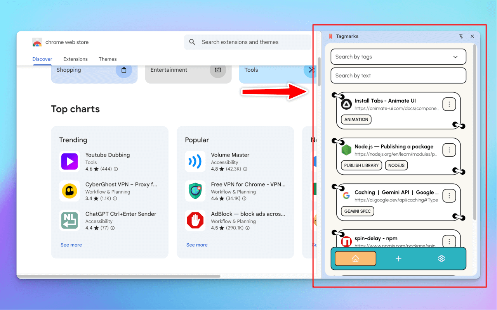
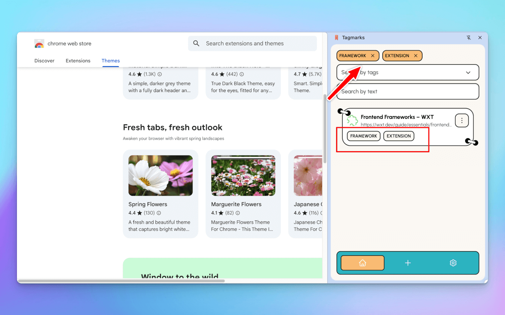
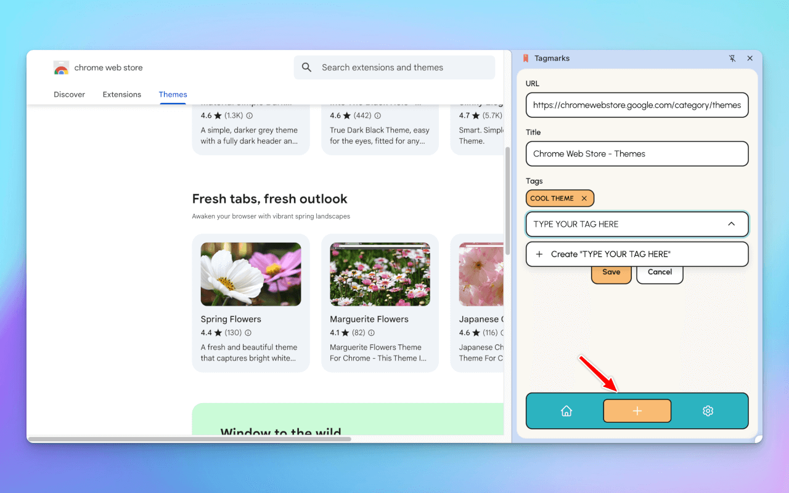
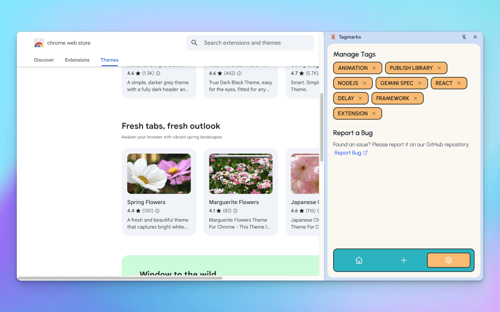

# Tagmarks - Chrome Extension

Tagmarks is a Chrome extension that enhances your bookmark management experience by adding tag-based organization. It helps you organize and find your bookmarks more efficiently using a modern, user-friendly interface.

## Features

- **Tag-Based Organization**: Add multiple tags to bookmarks for better organization
- **Smart Search**: Search bookmarks by tags or text
- **Quick Access**: Use the side panel for easy access to your bookmarks
- **Modern UI**: Clean and intuitive interface with undo/redo support
- **Tag Management**: Easily manage and organize your tags

## Installation

### From Chrome Web Store

1. Visit the Chrome Web Store
   - [Tagmarks on Chrome Web Store](https://chromewebstore.google.com/detail/tagmarks/dccibbhgimbepncebpkomijlkkaackep)
2. Click "Add to Chrome"
3. Confirm the installation

### Manual Installation

1. Clone this repository
2. Load the extension in Chrome:
   - Open Chrome and go to `chrome://extensions`
   - Enable "Developer mode"
   - Click "Load unpacked"
   - Select the `dist` folder from this project

## Usage

1. Click the Tagmarks icon in your Chrome toolbar to open the side panel
2. Add new bookmarks using the + button
3. Add tags to your bookmarks
4. Use the search bar or tag filtering to find your bookmarks
5. Manage your tags in the settings panel

## Requirements

- Chrome version 116 or higher

## Support

For issues and feature requests, please use the GitHub issues page.
